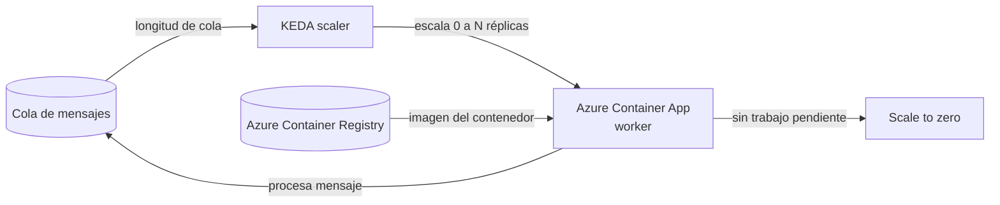

# Azure Container Apps (ACA)

## Qué es
Entorno serverless administrado sobre Kubernetes para microservicios y APIs de inferencia.

## Para qué sirve
Correr contenedores sin gestionar el clúster de K8s vos mismo.

## Cuándo usarlo (caso de uso típico de examen)
Worker que procesa mensajes de una cola (transcripción, embeddings) y debe escalar a 0 cuando no hay trabajo.

## Dato clave que suelen preguntar
Escala con **KEDA** según métricas externas (longitud de cola, HTTP, CPU); soporta **scale-to-zero** y despliegues **Canary/Blue-Green** por revisiones.

## Cómo funciona (diagrama)

KEDA observa la longitud de la cola y decide cuántas réplicas del Container App levantar, incluyendo bajar a cero cuando no hay mensajes. La imagen que corre sale de Azure Container Registry.
