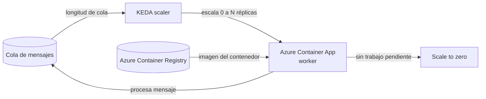

# Azure Container Apps (ACA)

## Qué es
Entorno serverless administrado sobre Kubernetes para microservicios y APIs de inferencia.

## Para qué sirve
Correr contenedores sin gestionar el clúster de K8s vos mismo.

## Cuándo usarlo (caso de uso típico de examen)
Worker que procesa mensajes de una cola (transcripción, embeddings) y debe escalar a 0 cuando no hay trabajo.

## Dato clave que suelen preguntar
Escala con **KEDA** según métricas externas (longitud de cola, HTTP, CPU); soporta **scale-to-zero** y despliegues **Canary/Blue-Green** por revisiones.

## Cómo funciona (diagrama)

KEDA observa la longitud de la cola y decide cuántas réplicas del Container App levantar, incluyendo bajar a cero cuando no hay mensajes. La imagen que corre sale de Azure Container Registry.

## Preguntas Frecuentes

**¿Container Apps reemplaza a AKS?**
No. ACA abstrae el control plane de Kubernetes para escenarios de microservicios/APIs comunes; si necesitás CRDs custom, operators o control total del clúster, seguís necesitando AKS.

**¿Puedo usar GPU en Container Apps?**
Sí, hay perfiles de workload con GPU para cargas de inferencia, pero no todas las regiones los ofrecen y tienen costo fijo (no escalan a cero como el resto).

**¿Qué pasa si mi contenedor tarda mucho en arrancar y el health probe falla?**
La revisión nunca queda "Ready" y el tráfico no se enruta a esa réplica; hay que configurar un `startupProbe` con timeout más generoso en vez de forzar el `readinessProbe`.

**¿Cómo hace ACA el despliegue Canary o Blue-Green?**
Cada cambio genera una revisión nueva; vos controlás qué porcentaje de tráfico va a cada revisión activa, permitiendo mover el 100% de golpe (blue-green) o de a poco (canary).

**¿Un Container App puede tener múltiples contenedores (sidecar)?**
Sí, dentro de una misma revisión podés correr un contenedor principal más sidecars (logging, proxy) que comparten ciclo de vida y red.

**¿Escala a cero corta las conexiones en curso?**
No de golpe: KEDA espera que no haya actividad (cola vacía, sin requests) antes de bajar réplicas; una request en curso no se corta a mitad de camino.
