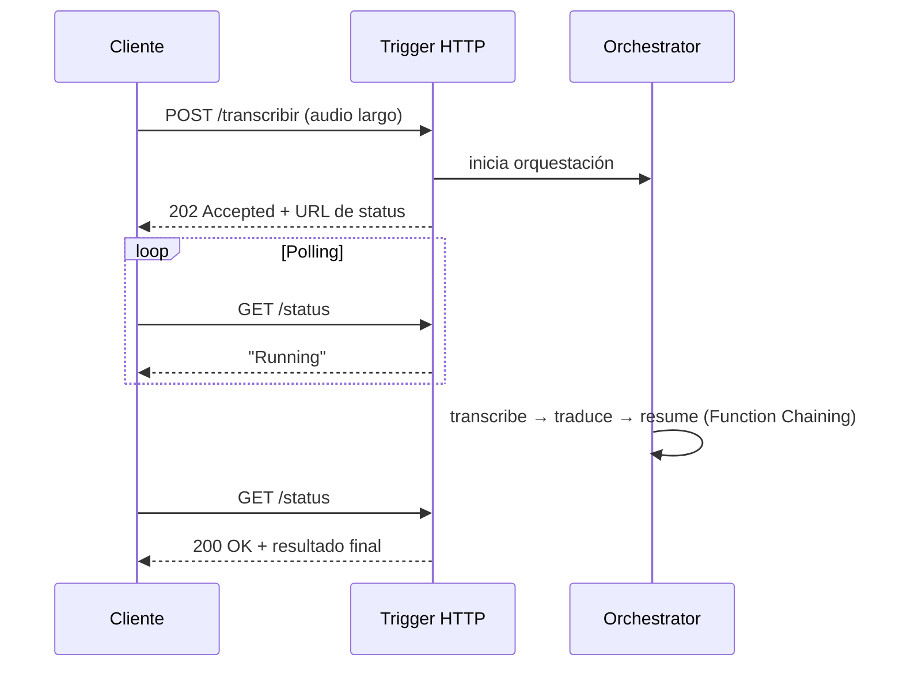

# Azure Durable Functions

## Qué es
Extensión de Azure Functions para orquestar flujos con estado.

## Para qué sirve
Encadenar pasos de IA (transcribir → traducir → resumir) sin perder el progreso si algo falla.

## Cuándo usarlo (caso de uso típico de examen)
Una tarea de IA tarda minutos (ej. transcribir un audio de 45 min) y la llamada HTTP no puede quedar colgada.

## Dato clave que suelen preguntar
Patrón **Async HTTP API** devuelve `202 Accepted` + URL de polling; **Fan-out/Fan-in** procesa fragmentos en paralelo y consolida; **Human-in-the-loop** pausa el flujo esperando aprobación humana.

## Cómo funciona (diagrama)

La llamada HTTP nunca queda colgada esperando: responde al instante con un `202` y una URL de consulta. El cliente pregunta ("polling") hasta que el flujo largo termina. Ideal para tareas de IA que tardan minutos.

## Preguntas Frecuentes

**¿Qué pasa si el host se reinicia a mitad de la orquestación?**
El framework hace "replay" del historial de eventos guardado y reconstruye el estado exacto donde quedó, sin repetir efectos secundarios ya ejecutados (siempre que el código de la orchestrator function sea determinístico).

**¿Por qué la orchestrator function no puede hacer una llamada HTTP directa?**
Porque se re-ejecuta (replay) muchas veces para reconstruir estado, y una llamada HTTP directa rompería el determinismo; ese trabajo tiene que ir en una Activity Function.

**¿Cuánto puede esperar un patrón Human-in-the-loop antes de expirar?**
Se define con un timeout explícito en el código (por ejemplo, `CreateTimer`); si nadie aprueba antes de ese plazo, la orquestación sigue por la rama de "timeout" en vez de quedar colgada indefinidamente.

**¿Fan-out/Fan-in es lo mismo que Function Chaining?**
No: Chaining encadena pasos secuenciales (A→B→C), mientras que Fan-out/Fan-in dispara N Activities en paralelo y espera a que todas terminen antes de consolidar el resultado.

**¿Dónde persiste Durable Functions el estado de la orquestación?**
En Azure Storage (tablas y colas) o Netherite/MSSQL según el backend configurado; de ahí sale el historial que permite el replay.

**¿Se puede cancelar una orquestación que ya arrancó?**
Sí, con la API de gestión (`Terminate`), aunque no revierte efectos ya aplicados por las Activities completadas.
