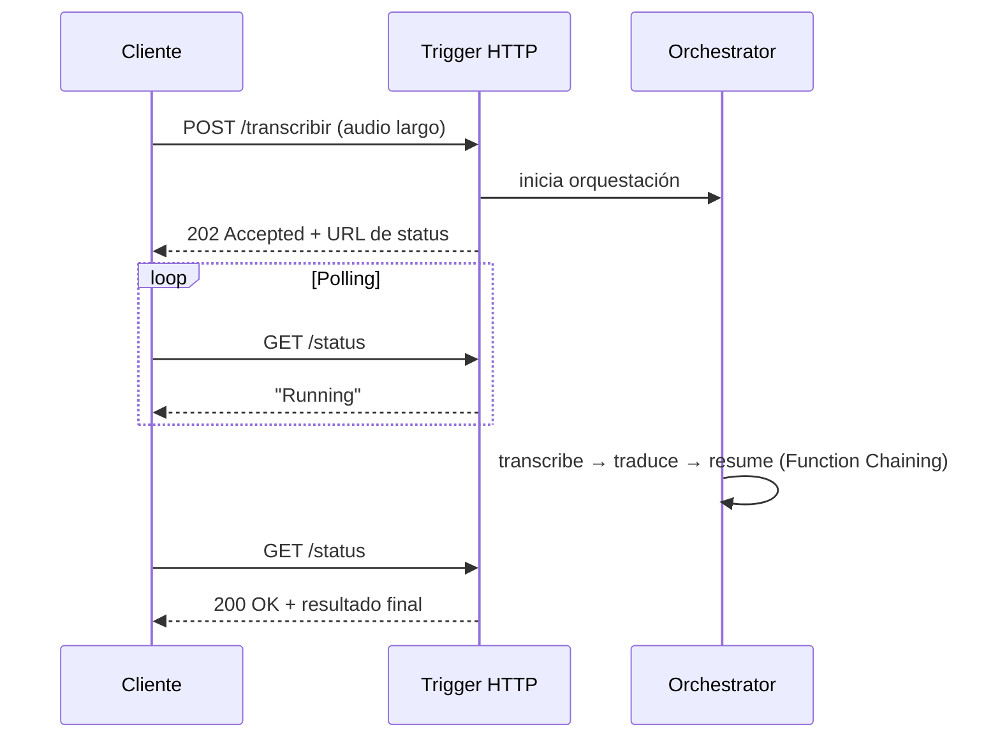

# Azure Durable Functions

## Qué es
Extensión de Azure Functions para orquestar flujos con estado.

## Para qué sirve
Encadenar pasos de IA (transcribir → traducir → resumir) sin perder el progreso si algo falla.

## Cuándo usarlo (caso de uso típico de examen)
Una tarea de IA tarda minutos (ej. transcribir un audio de 45 min) y la llamada HTTP no puede quedar colgada.

## Dato clave que suelen preguntar
Patrón **Async HTTP API** devuelve `202 Accepted` + URL de polling; **Fan-out/Fan-in** procesa fragmentos en paralelo y consolida; **Human-in-the-loop** pausa el flujo esperando aprobación humana.

## Cómo funciona (diagrama)

La llamada HTTP nunca queda colgada esperando: responde al instante con un `202` y una URL de consulta. El cliente pregunta ("polling") hasta que el flujo largo termina. Ideal para tareas de IA que tardan minutos.
