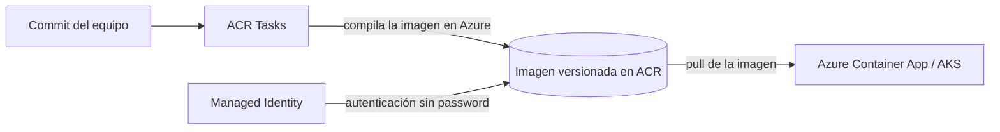

# Azure Container Registry (ACR)

## Qué es
Registro privado de imágenes Docker/OCI.

## Para qué sirve
Guardar y versionar las imágenes que corren en ACA/AKS.

## Cuándo usarlo (caso de uso típico de examen)
Necesitás compilar la imagen automáticamente al hacer commit.

## Dato clave que suelen preguntar
**ACR Tasks** compila en Azure sin Docker local; autenticación sin contraseña vía Managed Identity.

## Cómo funciona (diagrama)

El commit dispara ACR Tasks, que compila la imagen dentro de Azure (sin Docker local) y la deja versionada en el registro. El contenedor que la consume se autentica con Managed Identity, sin contraseñas.

## Preguntas Frecuentes

**¿ACR Tasks reemplaza un pipeline de CI/CD (Azure DevOps/GitHub Actions)?**
No, cubre solo la parte de build de la imagen; el pipeline sigue orquestando tests, aprobaciones y el despliegue del resto de la solución.

**¿Cómo escaneo vulnerabilidades en las imágenes de ACR?**
Con Microsoft Defender for Cloud integrado al registro, que analiza capas del sistema operativo y librerías al hacer push.

**¿Qué SKU necesito si tengo apps en varias regiones?**
El tier **Premium**, que habilita geo-replicación: la misma imagen queda disponible localmente en cada región sin depender de un solo endpoint.

**¿Puedo usar Docker Hub en vez de ACR?**
Se puede, pero perdés integración nativa con Managed Identity, geo-replicación y ACR Tasks; en escenarios empresariales de Azure, ACR es la opción por defecto.

**¿El "admin user" de ACR es necesario?**
No, y se recomienda dejarlo deshabilitado: es autenticación por contraseña compartida, mientras que Managed Identity + RBAC es el mecanismo seguro para pull/push.

**¿ACR versiona automáticamente las imágenes?**
No versiona solo: cada build de ACR Tasks te deja etiquetar (tag) la imagen, y la disciplina de versionado (semver, `:latest`, hash del commit) la define el pipeline.
