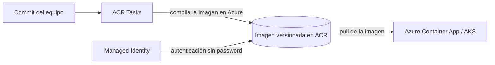

# Azure Container Registry (ACR)

## Qué es
Registro privado de imágenes Docker/OCI.

## Para qué sirve
Guardar y versionar las imágenes que corren en ACA/AKS.

## Cuándo usarlo (caso de uso típico de examen)
Necesitás compilar la imagen automáticamente al hacer commit.

## Dato clave que suelen preguntar
**ACR Tasks** compila en Azure sin Docker local; autenticación sin contraseña vía Managed Identity.

## Cómo funciona (diagrama)

El commit dispara ACR Tasks, que compila la imagen dentro de Azure (sin Docker local) y la deja versionada en el registro. El contenedor que la consume se autentica con Managed Identity, sin contraseñas.
