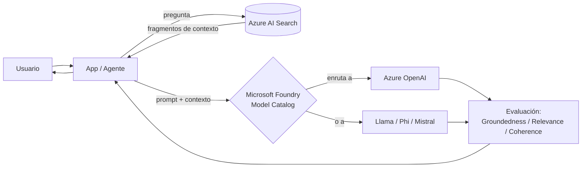

# Microsoft Foundry / Azure AI Studio

## Qué es
Plataforma unificada para construir, desplegar y orquestar modelos y agentes de IA.

## Para qué sirve
Catálogo de modelos (OpenAI, Llama, Phi, Mistral), evaluación y orquestación multi-agente.

## Cuándo usarlo (caso de uso típico de examen)
Necesitás comparar/cambiar de modelo sin reescribir la app, o encadenar varios agentes.

## Dato clave que suelen preguntar
Métricas de evaluación: **Groundedness** (¿se basa en el contexto real?), **Relevance** (¿responde la pregunta?), **Coherence** (¿fluye bien el texto?).

## Cómo funciona (diagrama)

Foundry es la capa que decide a qué modelo del catálogo enrutar el prompt (sin reescribir la app si cambiás de modelo) y después evalúa la respuesta con métricas de Groundedness, Relevance y Coherence antes de devolverla.
