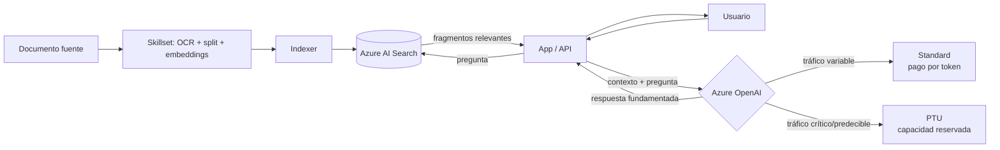

# Azure OpenAI Service

## Qué es
Los modelos de OpenAI desplegados dentro de Azure.

## Para qué sirve
Inferencia de LLMs con la seguridad y red de Azure.

## Cuándo usarlo (caso de uso típico de examen)
Tráfico variable → **Standard** (pago por token); tráfico crítico con latencia predecible → **PTU** (Provisioned Throughput Units, capacidad reservada).

## Dato clave que suelen preguntar
Ante `HTTP 429` (rate limit) la solución de código es **reintentos con backoff exponencial + jitter**; para forzar formato exacto usar **Structured Outputs** (`json_schema`).

## Cómo funciona (diagrama)

Azure OpenAI recibe el contexto recuperado por AI Search más la pregunta del usuario y genera la respuesta. La elección entre Standard y PTU depende del patrón de tráfico; un `429` en Standard se maneja con reintentos y backoff exponencial, no cambiando de plan automáticamente.
