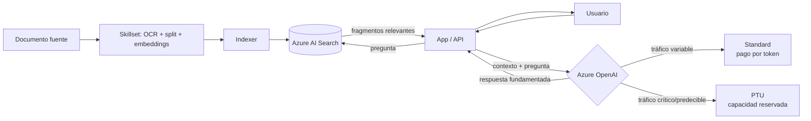

# Azure OpenAI Service

## Qué es
Los modelos de OpenAI desplegados dentro de Azure.

## Para qué sirve
Inferencia de LLMs con la seguridad y red de Azure.

## Cuándo usarlo (caso de uso típico de examen)
Tráfico variable → **Standard** (pago por token); tráfico crítico con latencia predecible → **PTU** (Provisioned Throughput Units, capacidad reservada).

## Dato clave que suelen preguntar
Ante `HTTP 429` (rate limit) la solución de código es **reintentos con backoff exponencial + jitter**; para forzar formato exacto usar **Structured Outputs** (`json_schema`).

## Cómo funciona (diagrama)

Azure OpenAI recibe el contexto recuperado por AI Search más la pregunta del usuario y genera la respuesta. La elección entre Standard y PTU depende del patrón de tráfico; un `429` en Standard se maneja con reintentos y backoff exponencial, no cambiando de plan automáticamente.

## Preguntas Frecuentes

**¿Qué diferencia hay entre el rate limit por RPM y por TPM?**
RPM limita cantidad de requests por minuto y TPM limita tokens procesados por minuto; podés recibir un `429` por superar cualquiera de los dos aunque el otro esté bien.

**¿Cuándo conviene PTU en vez de Standard si ya tengo cuota suficiente?**
Cuando necesitás latencia predecible garantizada; Standard comparte capacidad con otros tenants y puede variar, mientras que PTU reserva throughput dedicado.

**¿Azure OpenAI usa mis datos para entrenar sus modelos?**
No, por diseño del servicio los datos de prompts/completions del cliente no se usan para reentrenar los modelos base, a diferencia de la API pública de OpenAI en su tier gratuito.

**¿Structured Outputs reemplaza a function calling?**
No, son complementarios: Structured Outputs (`json_schema`) garantiza que la respuesta cumpla un esquema exacto, mientras que function calling define qué herramientas puede invocar el modelo.

**¿Puedo desplegar el mismo modelo en varias regiones para más cuota?**
Sí, es la estrategia habitual para escalar horizontalmente cuando una sola región no alcanza el TPM necesario, distribuyendo tráfico entre deployments regionales.

**¿Reintentar con backoff exponencial soluciona un 429 constante?**
Solo si el 429 es esporádico; si es sostenido, el problema real es cuota insuficiente y hay que pedir más TPM o migrar a PTU.
