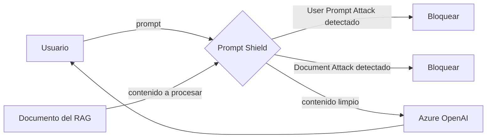

# Azure AI Content Safety

## Qué es
Servicio de moderación y protección de prompts.

## Para qué sirve
Filtrar contenido dañino y bloquear ataques al modelo.

## Cuándo usarlo (caso de uso típico de examen)
Un chat expuesto a usuarios externos que podría recibir inyección de prompts.

## Dato clave que suelen preguntar
**Prompt Shield** cubre **User Prompt Attacks** (inyección directa) y **Document Attacks** (instrucciones maliciosas ocultas en un PDF que el RAG procesa).

## Cómo funciona (diagrama)

Prompt Shield inspecciona tanto lo que escribe el usuario (User Prompt Attack) como el contenido de documentos que el RAG le pasa al modelo (Document Attack, inyección indirecta). Si detecta un ataque, bloquea antes de que llegue al LLM.
