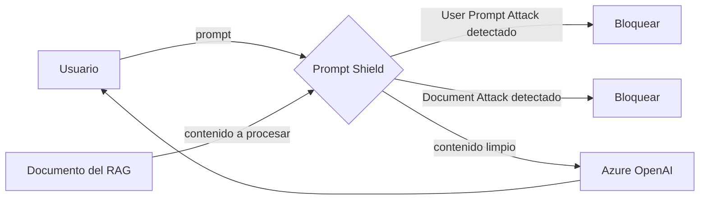

# Azure AI Content Safety

## Qué es
Servicio de moderación y protección de prompts.

## Para qué sirve
Filtrar contenido dañino y bloquear ataques al modelo.

## Cuándo usarlo (caso de uso típico de examen)
Un chat expuesto a usuarios externos que podría recibir inyección de prompts.

## Dato clave que suelen preguntar
**Prompt Shield** cubre **User Prompt Attacks** (inyección directa) y **Document Attacks** (instrucciones maliciosas ocultas en un PDF que el RAG procesa).

## Cómo funciona (diagrama)

Prompt Shield inspecciona tanto lo que escribe el usuario (User Prompt Attack) como el contenido de documentos que el RAG le pasa al modelo (Document Attack, inyección indirecta). Si detecta un ataque, bloquea antes de que llegue al LLM.

## Preguntas Frecuentes

**¿Content Safety reemplaza la moderación humana?**
No, filtra automáticamente el volumen masivo de contenido dañino evidente; casos límite (borderline) suelen seguir necesitando revisión humana.

**¿Qué categorías de daño cubre además de Prompt Shield?**
Detecta contenido de odio, sexual, violencia y autolesión, cada una con niveles de severidad configurables (0 a 7) para decidir el umbral de bloqueo.

**¿Puedo ajustar la sensibilidad del filtro por categoría?**
Sí, cada categoría de daño tiene su propio umbral de severidad, así que podés ser más estricto con violencia y más permisivo con otra según el caso de uso.

**¿Content Safety agrega latencia notable al pipeline del chat?**
Es una llamada API adicional antes (input) y opcionalmente después (output) del LLM; suma latencia pero es baja comparada con la generación del modelo.

**¿Document Attack detecta instrucciones ocultas en metadatos o solo en el texto visible?**
Analiza el contenido que el pipeline de RAG efectivamente extrae y le pasa al modelo, incluyendo texto oculto en el documento si el proceso de extracción lo captura.

**¿Groundedness Detection es lo mismo que Prompt Shield?**
No, son features distintas de Content Safety: Prompt Shield bloquea ataques de inyección, mientras que Groundedness Detection identifica si la respuesta del modelo se aleja del contexto dado (alucinación).
