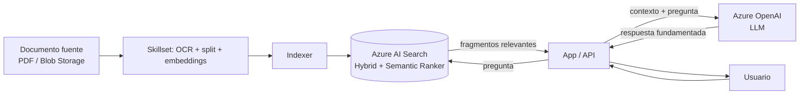

# Azure AI Search

## Qué es
El motor de búsqueda que arma la "R" de RAG (Retrieval).

## Para qué sirve
Encontrar los fragmentos de texto más relevantes para pasarle al LLM como contexto.

## Cuándo usarlo (caso de uso típico de examen)
Siempre que el LLM necesite responder con datos propios de la empresa.

## Dato clave que suelen preguntar
**Hybrid Search** (vectores + BM25) + **Semantic Ranker** da la mejor precisión; vectores usan **HNSW** (aproximado, rápido) o KNN exhaustivo (exacto, más lento).

## Cómo funciona (diagrama)

El documento se trocea, se convierte en vectores y se indexa una sola vez (ingesta). En cada pregunta del usuario, la app busca los fragmentos más relevantes en AI Search (combinando vectores + BM25 y reordenando con Semantic Ranker) y se los pasa al LLM como contexto — eso es lo que evita que el modelo "invente" (alucine).

## Preguntas Frecuentes

**¿Por qué usar Hybrid Search si ya tengo búsqueda vectorial?**
Porque los vectores fallan con términos exactos (códigos, nombres propios, siglas); BM25 los captura por keyword y el Semantic Ranker combina ambas señales para reordenar el resultado final.

**¿Qué pasa si el chunk (fragmento) es demasiado grande?**
Diluye la relevancia del embedding (mezcla varios temas en un solo vector) y desperdicia contexto del LLM; chunks demasiado chicos, en cambio, pierden contexto semántico completo.

**¿HNSW puede devolver resultados incorrectos?**
Es una búsqueda aproximada por diseño: prioriza velocidad sobre exactitud, así que puede omitir el vecino más cercano real a cambio de responder mucho más rápido que un KNN exhaustivo.

**¿Semantic Ranker reemplaza a los embeddings?**
No, actúa después: reordena (re-rank) los primeros resultados que ya trajeron BM25 y la búsqueda vectorial, no genera el conjunto de candidatos por sí solo.

**¿Cómo se actualiza el índice cuando cambia el documento fuente?**
El Indexer vuelve a correr sobre el Blob Storage (por schedule o manualmente) y reprocesa el Skillset; no hay sincronización automática en tiempo real salvo que se configure change detection.

**¿AI Search necesita Azure OpenAI para generar los embeddings?**
No es obligatorio: podés usar el modelo de embeddings de OpenAI u otro compatible; AI Search solo indexa y busca los vectores, no los genera.
