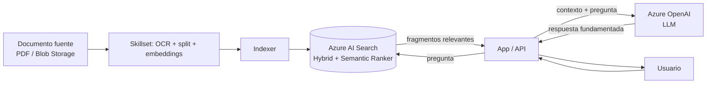

# Azure AI Search

## Qué es
El motor de búsqueda que arma la "R" de RAG (Retrieval).

## Para qué sirve
Encontrar los fragmentos de texto más relevantes para pasarle al LLM como contexto.

## Cuándo usarlo (caso de uso típico de examen)
Siempre que el LLM necesite responder con datos propios de la empresa.

## Dato clave que suelen preguntar
**Hybrid Search** (vectores + BM25) + **Semantic Ranker** da la mejor precisión; vectores usan **HNSW** (aproximado, rápido) o KNN exhaustivo (exacto, más lento).

## Cómo funciona (diagrama)

El documento se trocea, se convierte en vectores y se indexa una sola vez (ingesta). En cada pregunta del usuario, la app busca los fragmentos más relevantes en AI Search (combinando vectores + BM25 y reordenando con Semantic Ranker) y se los pasa al LLM como contexto — eso es lo que evita que el modelo "invente" (alucine).
