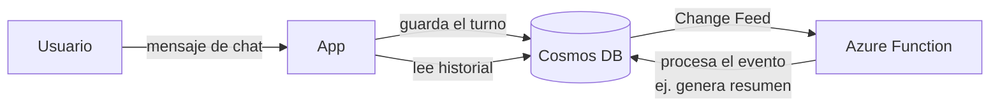

# Azure Cosmos DB

## Qué es
Base NoSQL de baja latencia con soporte de vectores integrado.

## Para qué sirve
Guardar el historial de conversación (memoria) y metadatos de usuario.

## Cuándo usarlo (caso de uso típico de examen)
Necesitás persistir sesiones de chat con latencia mínima.

## Dato clave que suelen preguntar
**Change Feed** dispara una Azure Function cada vez que se inserta/modifica un documento.

## Cómo funciona (diagrama)

Cada mensaje del chat se persiste en Cosmos DB con latencia mínima. El Change Feed detecta la inserción y dispara automáticamente una Function (por ejemplo, para generar un resumen o actualizar métricas), sin que la app tenga que sondear la base.

## Preguntas Frecuentes

**¿Cosmos DB reemplaza a Azure AI Search para hacer RAG?**
No, su búsqueda vectorial (Vector Search integrado) es una opción para casos más simples, pero AI Search sigue siendo la elección para hybrid search y Semantic Ranker sobre grandes catálogos de documentos.

**¿Qué nivel de consistencia conviene para historial de chat?**
Session consistency suele alcanzar: garantiza que el propio usuario siempre vea sus últimos mensajes sin pagar el costo de Strong, que es el más caro en latencia.

**¿Qué pasa si el Change Feed procesa eventos fuera de orden?**
Dentro de una misma partition key el orden se preserva; entre distintas particiones no hay garantía global de orden, algo a tener en cuenta si el resumen depende de secuencia exacta.

**¿Cómo afecta la partition key elegida al rendimiento?**
Una mala elección (ej. una key con pocos valores distintos) concentra las solicitudes en pocas particiones físicas y genera throttling aunque el RU/s total contratado alcance.

**¿Qué pasa si se agota el RU/s provisionado?**
Cosmos DB devuelve `429` (Request rate too large); se maneja con reintentos con backoff o pasando a modo autoscale/serverless según el patrón de tráfico.

**¿Change Feed garantiza que la Function se ejecute exactamente una vez?**
No, garantiza al-menos-una-vez: la Function debe ser idempotente porque un mismo cambio puede reprocesarse ante reintentos.
