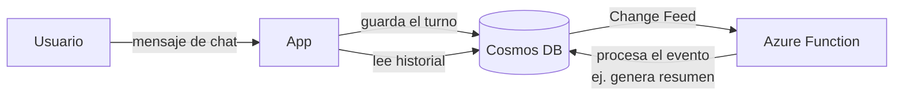

# Azure Cosmos DB

## Qué es
Base NoSQL de baja latencia con soporte de vectores integrado.

## Para qué sirve
Guardar el historial de conversación (memoria) y metadatos de usuario.

## Cuándo usarlo (caso de uso típico de examen)
Necesitás persistir sesiones de chat con latencia mínima.

## Dato clave que suelen preguntar
**Change Feed** dispara una Azure Function cada vez que se inserta/modifica un documento.

## Cómo funciona (diagrama)

Cada mensaje del chat se persiste en Cosmos DB con latencia mínima. El Change Feed detecta la inserción y dispara automáticamente una Function (por ejemplo, para generar un resumen o actualizar métricas), sin que la app tenga que sondear la base.
