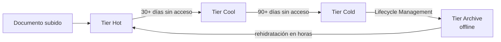

# Azure Blob Storage

## Qué es
Almacenamiento de objetos (archivos, PDFs, imágenes).

## Para qué sirve
Guardar los documentos fuente antes de indexarlos.

## Cuándo usarlo (caso de uso típico de examen)
Archivos que se consultan poco después de un tiempo deberían bajar de tier.

## Dato clave que suelen preguntar
Tiers **Hot → Cool (30+ días) → Cold (90+ días) → Archive** (offline, rehidratación en horas); **Lifecycle Management** los mueve solo.

## Cómo funciona (diagrama)

Lifecycle Management mueve automáticamente el blob entre tiers según hace cuánto no se accede a él, bajando el costo de almacenamiento. Archive es el más barato pero requiere horas de rehidratación antes de poder leerlo de nuevo.

## Preguntas Frecuentes

**¿Puedo leer un blob directamente estando en tier Archive?**
No, primero hay que rehidratarlo (moverlo a Hot o Cool), lo que tarda horas; si necesitás acceso urgente e impredecible, Archive no es el tier correcto para ese archivo.

**¿Lifecycle Management borra los blobs viejos o solo los mueve de tier?**
Puede hacer ambas cosas: las reglas se configuran para mover entre tiers por antigüedad de acceso, o directamente eliminar el blob después de cierto tiempo, según la política definida.

**¿El indexer de AI Search puede leer un blob en tier Cool o Cold?**
Sí, la indexación funciona igual en Hot/Cool/Cold; solo Archive queda inaccesible hasta rehidratar, lo que rompería un job de indexación programado.

**¿Cómo protejo documentos sensibles en Blob Storage?**
Con SAS tokens de vida corta o Managed Identity + RBAC en vez de exponer la connection string, más cifrado en reposo (que está habilitado por defecto).

**¿Qué diferencia hay entre Cool y Cold?**
Cool está pensado para datos de acceso infrecuente por ~30 días, con costo de storage menor y costo de acceso mayor; Cold es un escalón más barato para datos de +90 días con acceso aún más raro.

**¿Blob Storage puede disparar eventos automáticamente al subir un archivo?**
Sí, vía integración con Event Grid, que emite el evento `BlobCreated` y puede disparar una Function o arrancar el pipeline de indexación.
