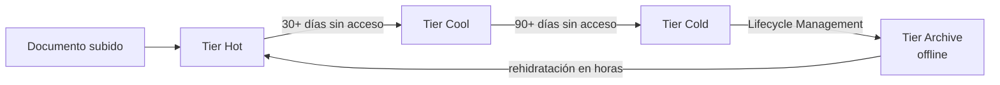

# Azure Blob Storage

## Qué es
Almacenamiento de objetos (archivos, PDFs, imágenes).

## Para qué sirve
Guardar los documentos fuente antes de indexarlos.

## Cuándo usarlo (caso de uso típico de examen)
Archivos que se consultan poco después de un tiempo deberían bajar de tier.

## Dato clave que suelen preguntar
Tiers **Hot → Cool (30+ días) → Cold (90+ días) → Archive** (offline, rehidratación en horas); **Lifecycle Management** los mueve solo.

## Cómo funciona (diagrama)

Lifecycle Management mueve automáticamente el blob entre tiers según hace cuánto no se accede a él, bajando el costo de almacenamiento. Archive es el más barato pero requiere horas de rehidratación antes de poder leerlo de nuevo.
