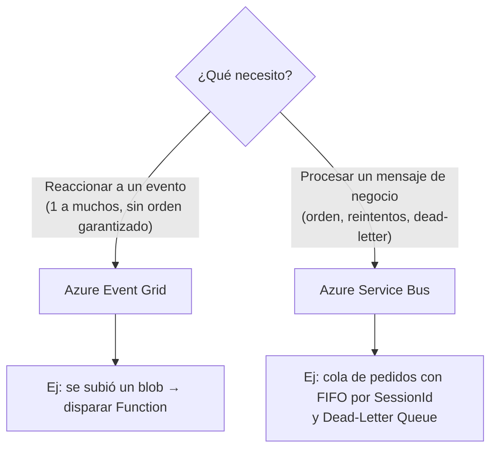

# Azure Event Grid vs Azure Service Bus

## Qué es
Dos sistemas de mensajería con propósitos distintos.

## Para qué sirve
Desacoplar servicios.

## Cuándo usarlo (caso de uso típico de examen)
**Event Grid** = reactividad ("algo pasó", serverless, sin garantía de orden). **Service Bus** = procesamiento de mensajes de negocio ("ejecutá esto", con colas/topics, orden garantizado).

## Dato clave que suelen preguntar
**Service Bus** tiene **Dead-Letter Queue** (mensajes que fallaron N veces) y **Sessions** (orden FIFO estricto por `SessionId`).

## Cómo funciona (diagrama)

**Event Grid** es para "algo pasó" (reactivo, serverless, alta escala, sin orden garantizado). **Service Bus** es para "ejecutá esta orden de negocio" (colas/topics, FIFO con Sessions, Dead-Letter Queue para mensajes que fallaron).
