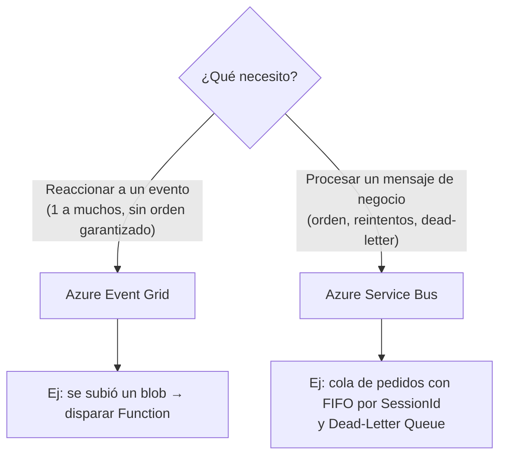

# Azure Event Grid vs Azure Service Bus

## Qué es
Dos sistemas de mensajería con propósitos distintos.

## Para qué sirve
Desacoplar servicios.

## Cuándo usarlo (caso de uso típico de examen)
**Event Grid** = reactividad ("algo pasó", serverless, sin garantía de orden). **Service Bus** = procesamiento de mensajes de negocio ("ejecutá esto", con colas/topics, orden garantizado).

## Dato clave que suelen preguntar
**Service Bus** tiene **Dead-Letter Queue** (mensajes que fallaron N veces) y **Sessions** (orden FIFO estricto por `SessionId`).

## Cómo funciona (diagrama)

**Event Grid** es para "algo pasó" (reactivo, serverless, alta escala, sin orden garantizado). **Service Bus** es para "ejecutá esta orden de negocio" (colas/topics, FIFO con Sessions, Dead-Letter Queue para mensajes que fallaron).

## Preguntas Frecuentes

**¿Puedo usar Event Grid y Service Bus juntos en la misma arquitectura?**
Sí, es un patrón común: Event Grid notifica "se subió un blob" y esa notificación encola un mensaje de negocio en Service Bus para procesarlo con reintentos y orden garantizado.

**¿Event Grid garantiza entrega exactly-once?**
No, garantiza at-least-once: el mismo evento puede llegar duplicado, así que el consumidor tiene que ser idempotente.

**¿Qué pasa si un consumer de Service Bus falla repetidamente al procesar un mensaje?**
Después de agotar el número configurado de reintentos (`MaxDeliveryCount`), el mensaje pasa automáticamente a la Dead-Letter Queue en vez de perderse o reintentarse infinito.

**¿Service Bus soporta publish/subscribe como Event Grid?**
Sí, con Topics y Subscriptions: un mismo mensaje puede llegar a múltiples suscriptores, cada uno con su propio filtro y cursor de lectura.

**¿Cuál tiene menor latencia end-to-end?**
Event Grid está optimizado para reactividad casi instantánea a gran escala; Service Bus prioriza garantías de entrega y orden por sobre latencia mínima.

**¿Sessions en Service Bus sirve para algo más que orden FIFO?**
También permite agrupar mensajes relacionados bajo el mismo `SessionId` para que un mismo consumer procese toda la secuencia sin que otro consumer la interrumpa.
