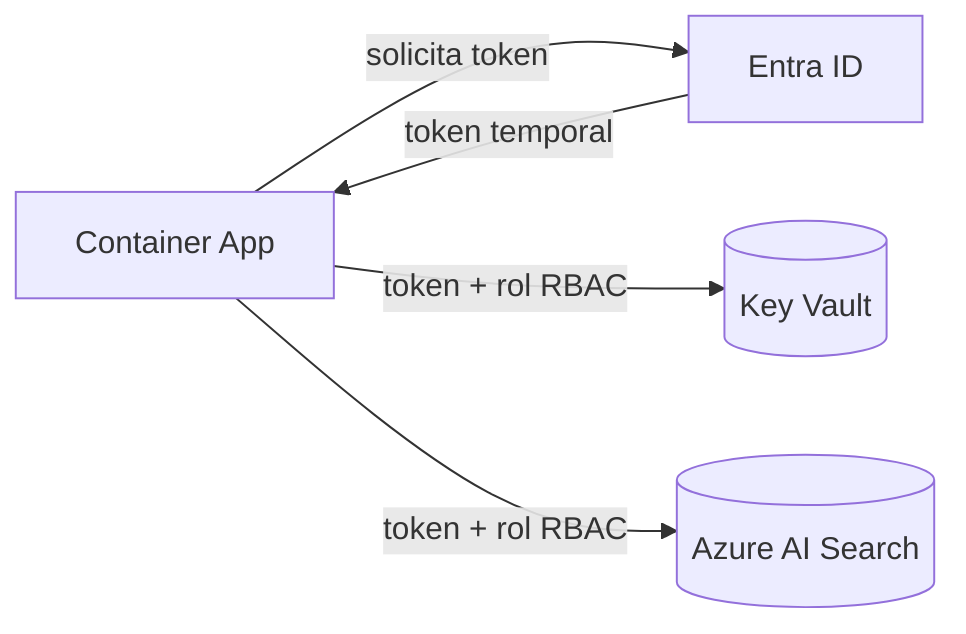

# Managed Identities

## Qué es
Identidad que Azure le da a un recurso para autenticarse sin contraseñas.

## Para qué sirve
Que un Container App llame a Key Vault o AI Search sin guardar ningún secreto.

## Cuándo usarlo (caso de uso típico de examen)
Siempre que la política de seguridad prohíba credenciales hardcodeadas.

## Dato clave que suelen preguntar
**System-Assigned** muere con el recurso; **User-Assigned** es independiente y se reutiliza entre varios recursos.

## Cómo funciona (diagrama)

El recurso pide un token temporal a Entra ID usando su Managed Identity y lo usa para autenticarse contra Key Vault o AI Search según el rol RBAC asignado — sin que ninguna contraseña o secreto quede guardado en el código.

## Preguntas Frecuentes

**¿Qué pasa con la identidad si borro el recurso que la tiene asignada?**
Si es System-Assigned, se borra junto con el recurso automáticamente; si es User-Assigned, sigue existiendo como recurso independiente y hay que borrarla aparte.

**¿Puedo compartir una misma identidad entre varios Container Apps?**
Sí, pero solo con User-Assigned: es justo el caso de uso para el que existe, ya que System-Assigned está atada 1 a 1 con un único recurso.

**¿Managed Identity funciona para autenticarme fuera de Azure?**
No directamente: es un mecanismo pensado para recursos que corren dentro de Azure y hablan con Entra ID; para on-premise se necesita otro flujo (service principal con certificado, por ejemplo).

**¿Alcanza con asignar la Managed Identity o también hay que dar el rol RBAC?**
Hacen falta ambas cosas: la identidad autentica ("quién sos"), pero sin un rol RBAC asignado sobre el recurso destino (Key Vault, AI Search) la autorización falla igual.

**¿Qué pasa si el token expira en medio de una operación larga?**
El SDK de Azure Identity lo renueva automáticamente de forma transparente; el desarrollador no gestiona manualmente el refresh del token.

**¿RBAC en Managed Identity es lo mismo que Access Policies de Key Vault?**
No, son dos modelos distintos: RBAC es el mecanismo recomendado hoy (roles a nivel de management plane), mientras que Access Policies es el modelo legacy específico de Key Vault.
