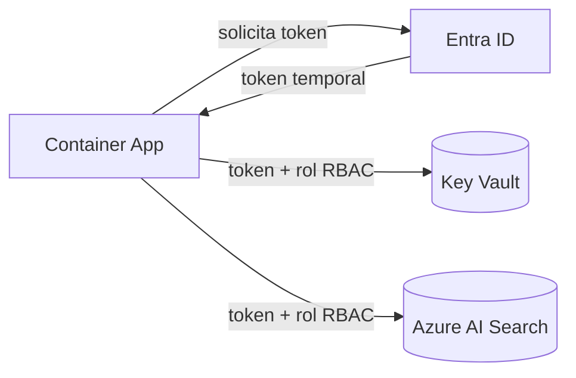

# Managed Identities

## Qué es
Identidad que Azure le da a un recurso para autenticarse sin contraseñas.

## Para qué sirve
Que un Container App llame a Key Vault o AI Search sin guardar ningún secreto.

## Cuándo usarlo (caso de uso típico de examen)
Siempre que la política de seguridad prohíba credenciales hardcodeadas.

## Dato clave que suelen preguntar
**System-Assigned** muere con el recurso; **User-Assigned** es independiente y se reutiliza entre varios recursos.

## Cómo funciona (diagrama)

El recurso pide un token temporal a Entra ID usando su Managed Identity y lo usa para autenticarse contra Key Vault o AI Search según el rol RBAC asignado — sin que ninguna contraseña o secreto quede guardado en el código.
