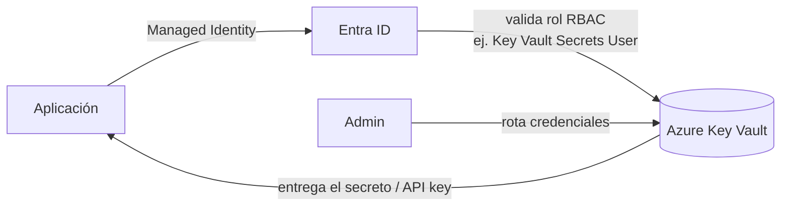

# Azure Key Vault

## Qué es
Bóveda segura de secretos y llaves.

## Para qué sirve
Guardar API keys externas con rotación.

## Cuándo usarlo (caso de uso típico de examen)
Cualquier secreto que no sea una identidad administrada directa.

## Dato clave que suelen preguntar
El acceso se da vía rol RBAC (ej. `Key Vault Secrets User`), no por contraseña maestra.

## Cómo funciona (diagrama)

La app nunca tiene el secreto embebido: pide un token vía Managed Identity, Entra ID valida que tenga el rol RBAC correcto (`Key Vault Secrets User`) y recién ahí Key Vault entrega el valor. La rotación la maneja el admin sin tocar el código de la app.

## Preguntas Frecuentes

**¿Key Vault rota automáticamente los secretos?**
No por sí solo: podés configurar una política de rotación (con una Function o Event Grid disparado por expiración cercana) para automatizarlo, pero no es un comportamiento por defecto.

**¿Qué diferencia hay entre RBAC y Access Policies en Key Vault?**
RBAC asigna permisos a nivel de management plane (mismo modelo que el resto de Azure) y es lo recomendado; Access Policies es el modelo legacy propio de Key Vault, más granular pero no unificado con el resto de RBAC de Azure.

**¿Key Vault guarda solo secretos tipo texto?**
No, también almacena llaves criptográficas (keys) y certificados, cada uno con su propio modelo de permisos y operaciones.

**¿Qué pasa si borro un secreto por error?**
Con **soft-delete** habilitado (default) queda recuperable por un período configurable; **purge protection** evita que alguien lo elimine definitivamente antes de ese período, ni siquiera un admin.

**¿Key Vault agrega latencia notable a cada request de la app?**
Sí que agrega una llamada de red extra, por eso la práctica recomendada es cachear el secreto en memoria de la app y refrescarlo solo periódicamente, no pedirlo en cada request.

**¿Cómo se audita quién accedió a un secreto?**
Vía diagnostic logs enviados a Log Analytics/Application Insights, que registran cada operación de lectura con la identidad que la hizo.
