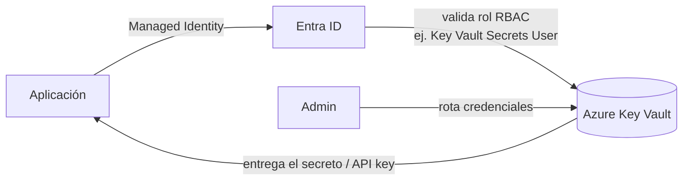

# Azure Key Vault

## Qué es
Bóveda segura de secretos y llaves.

## Para qué sirve
Guardar API keys externas con rotación.

## Cuándo usarlo (caso de uso típico de examen)
Cualquier secreto que no sea una identidad administrada directa.

## Dato clave que suelen preguntar
El acceso se da vía rol RBAC (ej. `Key Vault Secrets User`), no por contraseña maestra.

## Cómo funciona (diagrama)

La app nunca tiene el secreto embebido: pide un token vía Managed Identity, Entra ID valida que tenga el rol RBAC correcto (`Key Vault Secrets User`) y recién ahí Key Vault entrega el valor. La rotación la maneja el admin sin tocar el código de la app.
