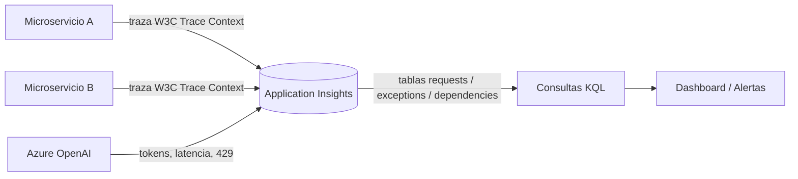

# Application Insights / Azure Monitor

## Qué es
Telemetría y monitoreo distribuido.

## Para qué sirve
Ver latencia, consumo de tokens, tasa de error 429 y trazas entre microservicios.

## Cuándo usarlo (caso de uso típico de examen)
Cualquier solución en producción necesita esto desde el día 1.

## Dato clave que suelen preguntar
**Distributed Tracing** usa el header estándar **W3C Trace Context**; las consultas se hacen en **KQL** sobre tablas `requests`, `exceptions`, `dependencies`.

## Cómo funciona (diagrama)

Cada microservicio propaga el header W3C Trace Context para que Application Insights pueda unir los spans de una misma request distribuida. Con KQL se consultan las tablas de requests, excepciones y dependencias para armar dashboards y alertas.

## Preguntas Frecuentes

**¿Application Insights es lo mismo que Azure Monitor?**
No, Application Insights es el componente de APM (Application Performance Monitoring) que corre sobre Azure Monitor, que es la plataforma más amplia de telemetría (incluye métricas de infraestructura, logs de plataforma, etc.).

**¿Hace falta instrumentar manualmente cada microservicio para propagar el trace?**
No siempre: el Auto-Instrumentation Agent inyecta la propagación del header W3C automáticamente en muchos stacks (.NET, Java, Node), sin tocar el código de la app.

**¿Qué es el sampling y cómo afecta un análisis de errores raros?**
Es la reducción del volumen de telemetría enviada para bajar costo; con sampling agresivo, un error que ocurre poco puede no quedar capturado, así que hay que calibrarlo según qué tan crítico es no perder eventos.

**¿Application Insights agrega overhead notable de performance?**
Es bajo pero no cero: el SDK agrega la telemetría de forma asíncrona en background, y el sampling existe justamente para mantener ese costo controlado a escala.

**¿Necesito saber KQL para el examen o solo usar el portal?**
El examen espera que entiendas al menos consultas básicas sobre `requests`, `exceptions` y `dependencies`, porque muchos escenarios de troubleshooting se resuelven mostrando una query KQL concreta.

**¿Cómo configuro una alerta sobre la tasa de 429 de Azure OpenAI?**
Con una alert rule sobre una consulta KQL programada (o una métrica) que cuenta respuestas 429 en la tabla `dependencies`/`requests` dentro de una ventana de tiempo, disparando notificación al superar el umbral.
