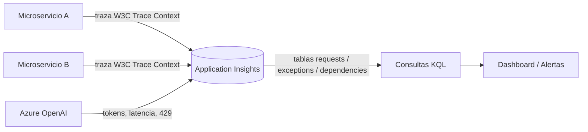

# Application Insights / Azure Monitor

## Qué es
Telemetría y monitoreo distribuido.

## Para qué sirve
Ver latencia, consumo de tokens, tasa de error 429 y trazas entre microservicios.

## Cuándo usarlo (caso de uso típico de examen)
Cualquier solución en producción necesita esto desde el día 1.

## Dato clave que suelen preguntar
**Distributed Tracing** usa el header estándar **W3C Trace Context**; las consultas se hacen en **KQL** sobre tablas `requests`, `exceptions`, `dependencies`.

## Cómo funciona (diagrama)

Cada microservicio propaga el header W3C Trace Context para que Application Insights pueda unir los spans de una misma request distribuida. Con KQL se consultan las tablas de requests, excepciones y dependencias para armar dashboards y alertas.
